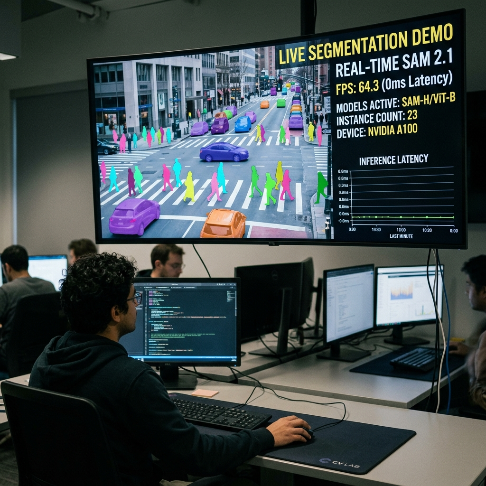

# Segment Anything 2 Real-Time 🎥


Run the powerful Segment Anything Model 2 (SAM 2.1) on live video streams at 30+ FPS. Built for computer vision engineers and roboticists who need zero-shot, highly accurate segmentation in real-time production environments.



## ✨ Key Features

- **Process live streams at 30+ FPS**: Achieve true real-time performance on standard consumer GPUs without sacrificing mask quality.
- **Track objects temporally**: Maintain consistent instance IDs across frames even during occlusions or fast camera movements.
- **Prompt via multiple inputs**: Initiate tracking using bounding boxes, point clicks, or negative points directly on the first frame.
- **Integrate easily with OpenCV**: Plug-and-play with standard `cv2.VideoCapture` streams from webcams, RTSP, or local files.
- **Leverage updated SAM 2.1**: Utilize the latest hierarchical vision transformer architecture for unmatched zero-shot generalization.
- **Optimize memory usage**: Benefit from our customized `non_cond_frame_outputs` management to prevent VRAM overflow during long streams.

## 🚀 Quick Start

Get live camera segmentation running in under 5 minutes.

1. **Install the environment**:
   ```bash
   git clone https://github.com/your-repo/segment-anything-2-real-time.git
   cd segment-anything-2-real-time
   pip install -e .
   ```

2. **Download the pre-trained weights**:
   ```bash
   cd checkpoints
   ./download_ckpts.sh
   cd ..
   ```

3. **Run the camera demo**:
   ```bash
   python demo/camera_tracking.py --checkpoint checkpoints/sam2.1_hiera_small.pt --config configs/sam2.1/sam2.1_hiera_s.yaml
   ```

**Expected Output:**
A window will pop up showing your webcam feed. Click on an object in the frame. The model will instantly generate a mask and continuously track that object as it moves around in real-time.

*You have just initialized a zero-shot tracking pipeline using a single click!*

## 📦 Installation

### Method 1: Using pip (Virtual Environment)
```bash
python3 -m venv venv
source venv/bin/activate
pip install -e .
```

### Method 2: Using Conda
Ideal for managing CUDA toolkits and strict PyTorch versions.
```bash
conda create -n sam2_rt python=3.11
conda activate sam2_rt
conda install pytorch torchvision torchaudio pytorch-cuda=12.1 -c pytorch -c nvidia
pip install -e .
```

## 💡 Usage Examples

### Example 1: Web Camera Prediction
**Scenario:** You want to track your hand or a physical object using your laptop's webcam.
```python
import torch
import cv2
from sam2.build_sam import build_sam2_camera_predictor

predictor = build_sam2_camera_predictor(
    "configs/sam2.1/sam2.1_hiera_s.yaml", 
    "checkpoints/sam2.1_hiera_small.pt"
)

cap = cv2.VideoCapture(0) # Open default webcam

with torch.inference_mode(), torch.autocast("cuda", dtype=torch.bfloat16):
    while True:
        ret, frame = cap.read()
        # Initial prompt logic here...
        # mask = predictor.track(frame)
        # cv2.imshow("SAM2 Tracking", mask)
```
**Output:** Continuous frame-by-frame mask generation.

### Example 2: Bounding Box Prompting on Video Files
**Scenario:** You have a pre-recorded MP4 file and the initial coordinates of a vehicle.
```bash
python demo/video_inference.py \
    --video ./assets/traffic.mp4 \
    --bbox 150 200 350 400 \
    --output ./results/traffic_segmented.mp4
```
**Output:** Generates `traffic_segmented.mp4` where the target vehicle is highlighted with a colored overlay throughout the entire clip.

### Example 3: Multi-Object Tracking
**Scenario:** Tracking two different players in a sports broadcast simultaneously.
Provide multiple point prompts. The predictor state will maintain separate instance IDs (e.g., `obj_1`, `obj_2`) and output a combined mask tensor.
```python
# Pass a dictionary of prompts
prompts = {
    1: {"points": [[100, 200]], "labels": [1]}, # Player 1
    2: {"points": [[500, 300]], "labels": [1]}  # Player 2
}
predictor.init_state(frame, prompts)
```

## 🛠️ Troubleshooting

- **`CUDA Out of Memory`**
  - *Cause:* The context memory queue grew too large during a long video stream.
  - *Fix:* Ensure you are using the latest version which includes the `non_cond_frame_outputs` fix. Alternatively, use a smaller checkpoint (`hiera_tiny.pt`).
- **`RuntimeError: Expected all tensors to be on the same device`**
  - *Cause:* PyTorch tensors are split between CPU and GPU.
  - *Fix:* Ensure your environment has CUDA enabled and `torch.cuda.is_available()` returns `True`.
- **Sluggish FPS (< 10 FPS)**
  - *Cause:* Not using `bfloat16` or `inference_mode`.
  - *Fix:* Wrap your tracking loop in `with torch.inference_mode(), torch.autocast("cuda", dtype=torch.bfloat16):`.

## 📚 Documentation Links

Unlock the full potential of real-time segmentation by exploring our detailed documentation:

- **[System Architecture](./docs/ARCHITECTURE.md)**
  Delve into the inner workings of our SAM 2.1 implementation and discover how we achieve 30+ FPS on live video streams. This document breaks down the complete data flow, the hierarchical vision transformer backbone, and our custom memory management strategy.

- **[API Reference](./docs/API_REFERENCE.md)**
  Explore the comprehensive API payloads and function signatures needed to integrate zero-shot tracking into your own applications. Learn how to programmatically initialize predictor states, pass multi-modal prompts, and handle the output mask tensors seamlessly.

- **[Configuration Guide](./docs/CONFIGURATION.md)**
  Fine-tune the model to your exact hardware and performance requirements. From adjusting inference precision to exhaustive hyperparameter tuning for temporal tracking consistency, this guide provides all the levers you need for production deployment.

## 🤝 Contributing

1. Fork the repository
2. Create your feature branch (`git checkout -b feature/AmazingFeature`)
3. Commit your changes (`git commit -m 'Add some AmazingFeature'`)
4. Push to the branch (`git push origin feature/AmazingFeature`)
5. Open a Pull Request

See [CONTRIBUTING.md](./CONTRIBUTING.md) for detailed guidelines.

## 📄 License

This project is licensed under the Apache 2.0 License - see the [LICENSE](./LICENSE) file for details.

## 👏 Credits
Based on the foundational work by Meta FAIR on Segment Anything 2.
